# HexScript

HexBrowns が AviUtl ExEdit2 向けに作ったスクリプト集です。設定ダイアログでは `HexScript` の下に並びます。

- 開発環境: AviUtl ExEdit2 2.1.11a
- ライセンス: [MIT-0](LICENSE)（再配布・改変・商用利用は自由、表記も不要）。ただし「改造」の欄のファイルは元作品の権利が元作者にあります（[THIRD_PARTY_NOTICES.md](THIRD_PARTY_NOTICES.md)）
- 使い方は [docs/](docs/) の各ファイルにあります

## 導入

1. [Releases](https://github.com/HexBrowns/HexScript/releases) から `HexScript_v*.zip` をダウンロードして展開する
2. `Script/` の中身を、AviUtl2 の `Script` フォルダ（既定は `C:\ProgramData\aviutl2\Script`）へコピーする。使うものだけでかまいません。ただし下の「一緒に置くファイル」は忘れずに
3. プリセットが要るなら、`Preset/`・`Default/`・`Alias/` の中身を、AviUtl2 のデータフォルダの同名のフォルダへコピーする（`Alias/` はフォルダごと）
4. AviUtl2 を起動し直す

**ファイル名の先頭の `@` は消さないでください。** 1 つのファイルに複数のスクリプトが入っているものは、`@` で始まる名前でないと分割されません。

### 一緒に置くファイル

| スクリプト | 一緒に置くもの |
|---|---|
| `@Filters_H.anm2` | `EffectUtils_Noise.lua` `EffectUtils_ColorGrade.lua` |
| `プロシージャル模様_H.obj2` | `EffectUtils_ColorGrade.lua` |
| `@ローポリ化.anm2` `@ローポリ背景.obj2` | `EffectUtils_Lowpoly.lua` |
| `@拡張パーティクル_H.anm2` | `Particle_H.lua`（プリセットを使うなら `Alias/拡張パーティクル_H/` も） |

## 収録スクリプト

### 画面全体・色

| 見本 | ファイル | 内容 | 説明書 |
|---|---|---|---|
| 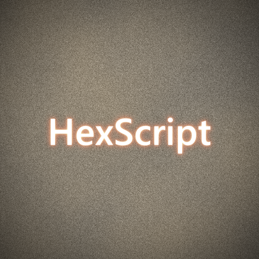 | `@Filters_H.anm2` | フィルム調の加工 17 種（グリッチ、グレイン、ハレーション、ライトリーク、ビネット、アナモルフィックフレア、リキッドディストーション、シマー、フォグヘイズ、フィルムバーン、カラーグレード、リフト・ガンマ・ゲイン、バレル歪み、ノイズオーバーレイ、バイブランス、HSL選択補正、LUT適用） | [docs](docs/Filtersフィルタ使用ガイド.md) |
| 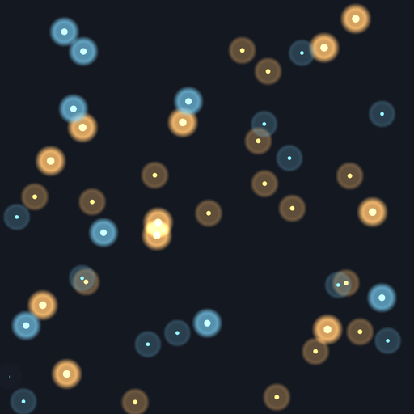 | `@光学系ボケ.anm2` | レンズで撮ったようなボケ 4 種（玉ボケ、レンズぼかし、チルトシフト、球面収差ボケ） | [docs](docs/光学系ボケ.md) |
| 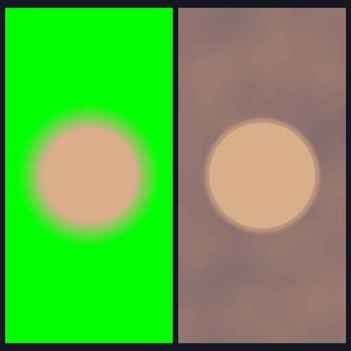 | `@キーイング_H.anm2` | 背景を抜いた素材の仕上げ 3 種（マット調整、スピル除去、トラックマット） | [docs](docs/キーイング_H.md) |
| 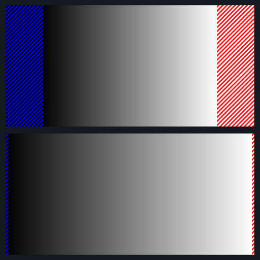 | `レンジ警告_H.anm2` | 白飛び・黒潰れ・色域外の画素をゼブラで示す検査用の効果 | [docs](docs/レンジ警告_H.md) |

### 変形・配置

| 見本 | ファイル | 内容 | 説明書 |
|---|---|---|---|
| 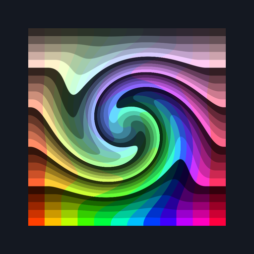 | `@ShapeDistort_H.anm2` | 画像をゆがませる 4 種（回転、放射、方向、ジグザグ） | [docs](docs/ShapeDistort_H.md) |
| 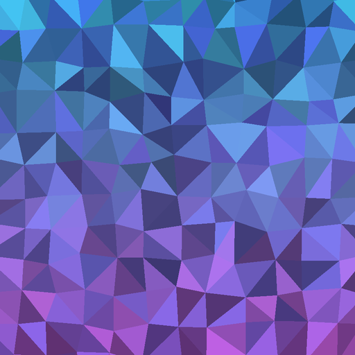 | `@ローポリ化.anm2` `@ローポリ背景.obj2` | オブジェクトのローポリ化と、ローポリの背景 | [docs](docs/ローポリ.md) |
| 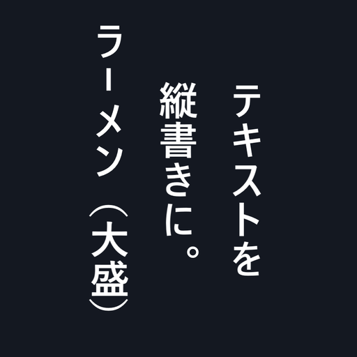 | `テキスト縦書き化.anm2` | 横書きのテキストを、文字ごとのオブジェクトのまま縦書きに並べる | [docs](docs/テキスト縦書き化.md) |
| 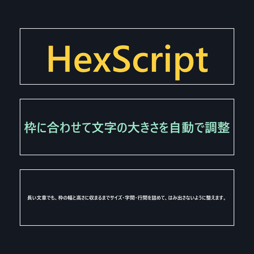 | `枠内自動フィット_H.obj2` | 指定した枠に収まる最大のフォントサイズで文字を出す | [docs](docs/枠内自動フィット_H.md) |

### 光・粒・模様

| 見本 | ファイル | 内容 | 説明書 |
|---|---|---|---|
| 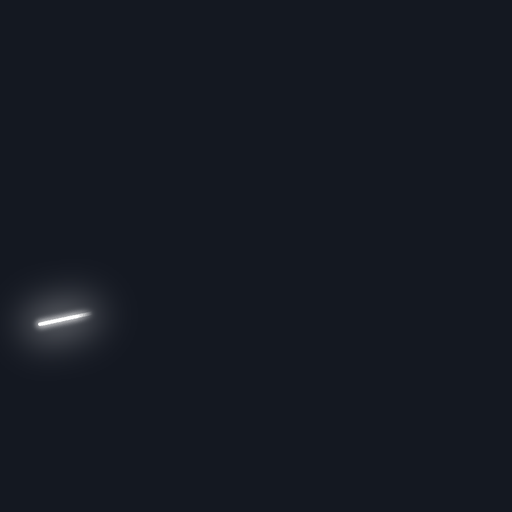 | `光線経路_H.obj2` | 鏡で反射し、プリズムで分光する光線の経路を描く | [docs](docs/光線経路_H.md) |
|  | `光束_H.anm2` | オブジェクトの形から光の筋を伸ばす | [docs](docs/光束_H.md) |
|  | `ビーム化_H.anm2` | 形を、白い芯と色の付いた光のビームに描き替える | [docs](docs/ビーム化_H.md) |
| 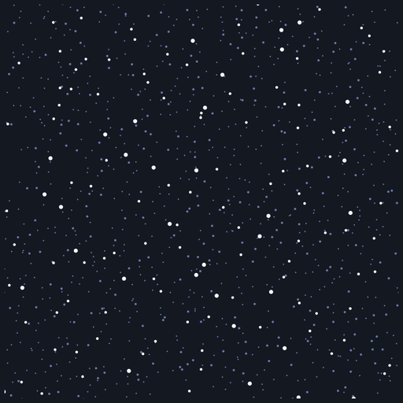 | `微粒子_H.obj2` | ほこり・浮遊物・細かい雪などの粒を流す | [docs](docs/微粒子_H.md) |
| 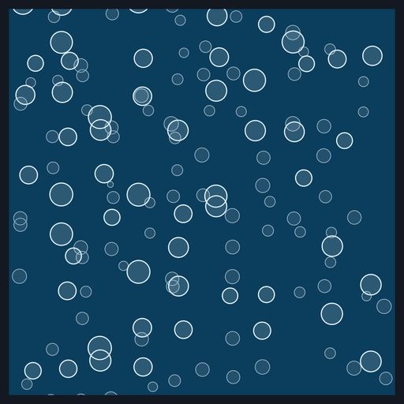 | `泡_H.obj2` | 泡を描く | [docs](docs/泡_H.md) |
| 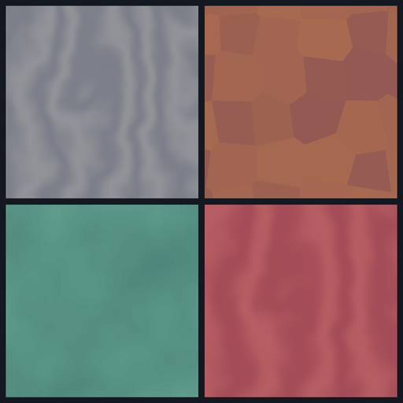 | `プロシージャル模様_H.obj2` | 雲・縞・セル・六方格子・反応拡散から模様を作る（プリセット 22 本） | [docs](docs/プロシージャル模様_H.md) |
| 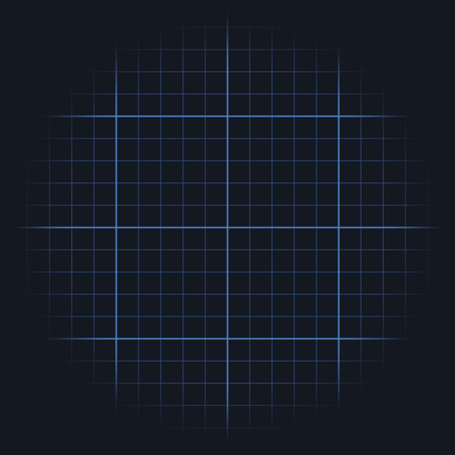 | `グリッド_H.obj2` | 線の網目や、図形を等間隔に並べた模様 | [docs](docs/グリッド_H.md) |
| 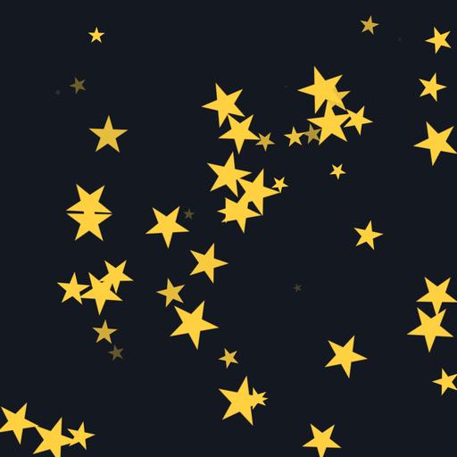 | `装飾パーティクル_H.anm2` | オブジェクトの範囲に粒を出しては消す（アス（AVILITY）さんの「装飾パーティクル」の軽量版） | [docs](docs/装飾パーティクル_H.md) |
|  | `@拡張パーティクル_H.anm2` | 画像を粒子として放出する。風・力場・パス・跳ね返り・子粒子・軌跡・光源など 32 種類の拡張を積んで組み合わせる（プリセット 22 本）。rikky さんの「拡張パーティクル(R)」を AviUtl2 向けに作り直したもの | [docs](docs/拡張パーティクル_H.md) |

### カメラ・シーン

| 見本 | ファイル | 内容 | 説明書 |
|---|---|---|---|
| 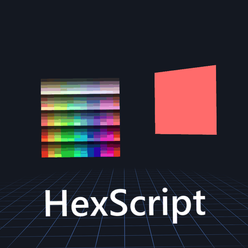 | `手持ちカメラ_H.cam2` | 手持ち撮影のような揺れ | [docs](docs/手持ちカメラ_H.md) |
|  | `@SceneTransitions.scn2` | シーンチェンジ 3 種（スマッシュカット、ズームトランジション、パララックス） | [docs](docs/SceneTransitions.md) |

### 制作補助

| 見本 | ファイル | 内容 | 説明書 |
|---|---|---|---|
| 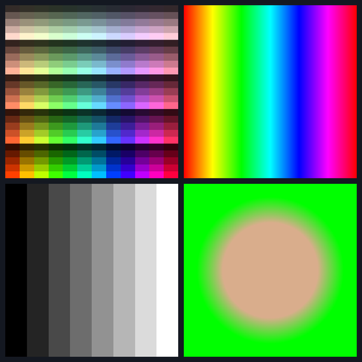 | `検証パターン_H.obj2` | 階調・色相・肌色などのテストパターン 9 種 | [docs](docs/検証パターン_H.md) |

### 改造（元作品の作者またはライセンスが不明）

元作品の部分の権利は元作者にあります。元作品は [THIRD_PARTY_NOTICES.md](THIRD_PARTY_NOTICES.md) にまとめてあります。

| ファイル | 内容 | 説明書 |
|---|---|---|
| `@KD_DepthMap_H.anm2` | 深度画像で、オブジェクトを奥行きで切り抜く | [docs](docs/KD_DepthMap_H.md) |
| `@カメラ効果_H.cam2` | カメラを回す・動かす・目標をずらす・傾ける・寄る | [docs](docs/カメラ効果_H.md) |
| `テキスト両端揃え_H.anm2` | テキストの各行を両端揃えに並べ直す | [docs](docs/テキスト両端揃え_H.md) |
| `キラキラ_H.anm2` | オブジェクトを粒にして放射状に弾け飛ばす | [docs](docs/キラキラ_H.md) |
| `カラフルパーティクル_H.obj2` | 図形の粒を放射状に飛ばす | [docs](docs/カラフルパーティクル_H.md) |
| `カラフルランダム配置_H.obj2` | 図形の粒を画面にばらまく | [docs](docs/カラフルランダム配置_H.md) |
| `円形変位_H.anm2` | 今の位置を中心とした円の上へ動かす | [docs](docs/円形変位_H.md) |
| `ランダム2_H.anm2` | 位置・回転・拡大率・透明度をオブジェクトごとにずらす | [docs](docs/ランダム2_H.md) |
| `偽被写界深度_H.anm2` | カメラからの距離に応じてぼかす | [docs](docs/偽被写界深度_H.md) |
| `円形配置プラス.anm2` | 円（楕円）の周に並べる | [docs](docs/円形配置プラス.md) |
| `sin揺れ_HB.anm2` | 帯ごとにずらした正弦波で揺らす | [docs](docs/sin揺れ_HB.md) |
| `@図形グラデーション_H.anm2` | 形はそのままに、中身をグラデーションで塗り替える | [docs](docs/図形グラデーション_H.md) |
| `レベル補正_H.anm2` | 黒点・白点・中間調と出力の範囲で明るさを整える | [docs](docs/レベル補正_H.md) |

## フォーク

元作品が GitHub で公開されているものは、元のリポジトリのフォークに置いています。

| ファイル | 置き場所 | 元作品 |
|---|---|---|
| `ロングシャドー_H.anm2` `トーンカーブ_H.anm2` | [HexBrowns/aviutl2-scripts](https://github.com/HexBrowns/aviutl2-scripts) | こんにゃくねこ さんの LongShadow / Tonecurve_C（CC0-1.0） |
| `ブラインドループ_H.anm2` | [gist のフォーク](https://gist.github.com/HexBrowns/ba9203470e0fad888421a76760afb417) | zopty さんのブラインドループ（BSD-3-Clause） |
| `モザイク_H.anm2` | [HexBrowns/aviutl2_script_Pixelizer](https://github.com/HexBrowns/aviutl2_script_Pixelizer) | nctype さんの Pixelizer（MIT） |
| `多色グラデーション_H.anm2` | [HexBrowns/AviUtl2-GradientPlus](https://github.com/HexBrowns/AviUtl2-GradientPlus) | azurite さんのグラデーション+（CC0-1.0） |
| `@連結ライン_Hex.anm2` | [HexBrowns/aviutl2_script_Path_S](https://github.com/HexBrowns/aviutl2_script_Path_S) | σ軸 さんの Path_S（MIT） |
| `放射分布_H.anm2` `オートターゲット_H.cam2` `座標公開_H.anm2` | [HexBrowns/ported_tim](https://github.com/HexBrowns/ported_tim) | ティム さんのスクリプト（Nanashi. さんの移植、MIT） |
